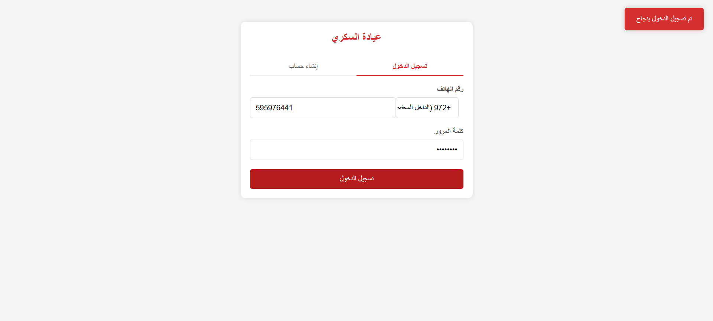
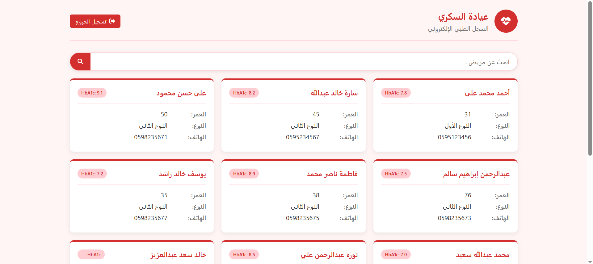
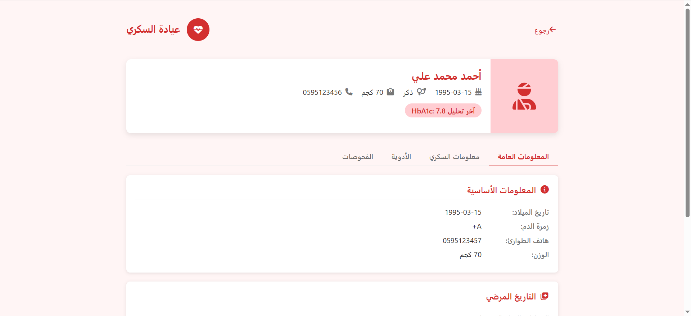
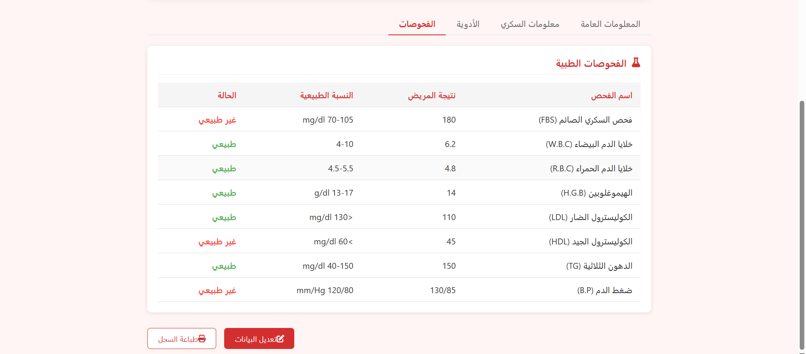
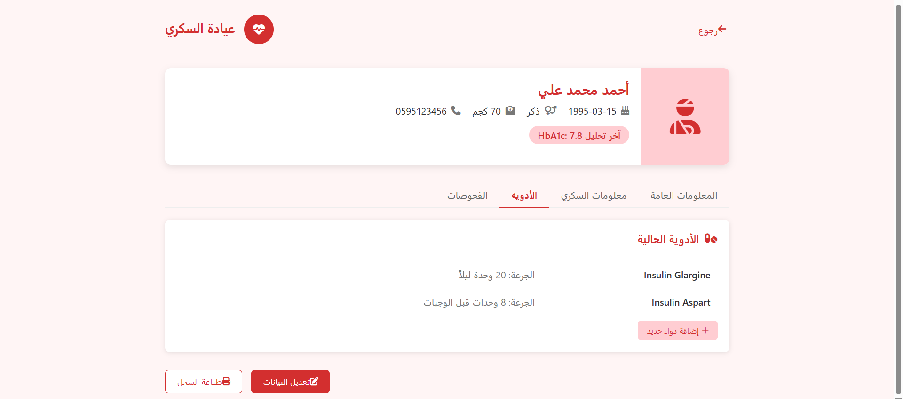
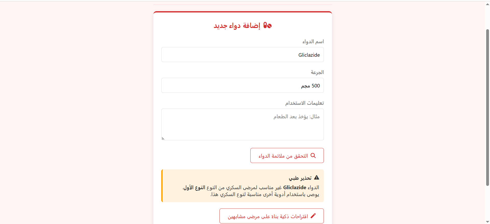
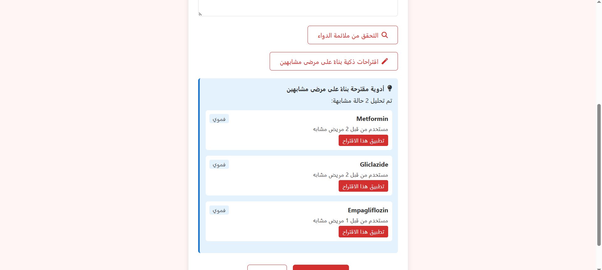
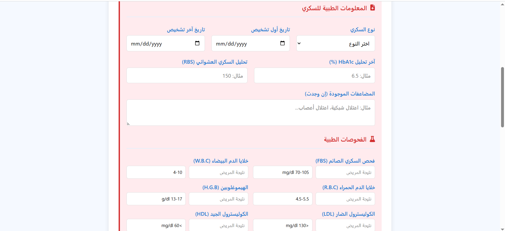

# 📋 DiaCare – Diabetes Clinic Management System

## 🎓 Graduation Project – Bachelor's Degree in Computer Information Systems  
**Al-Quds Open University**

---

## 📖 About The Project

**DiaCare** is an integrated system for managing diabetes patients, developed as a **graduation project** for the Bachelor's degree in **Computer Information Systems** at Al-Quds Open University.

The system aims to:
- Electronically register and track diabetes patients
- Analyze medication suitability based on patient condition
- Provide smart medication suggestions based on similar cases
- Track medical tests and identify abnormal results

---

## 🖼️ Screenshots

| Page | Description |
|------|-------------|
|  | Login and account creation interface |
|  | Patient list with HbA1c indicator |
|  | Patient details and basic information |
|  | Tests table with status (normal/abnormal) |
|  | Current medications list and add new medication |
|  | Add medication form with compatibility check |
|  | Medication suggestions based on similar cases |
|  | Diabetes medical information input |
---

## 🚀 Key Features

### 🔐 Authentication System
- Login and create new account
- User data stored in `localStorage`
- Data validation (password match, unique phone number)

### 👨‍⚕️ Patient Management
- Add new patient (name, age, weight, blood type, diabetes type)
- Edit patient data (inline editing mode)
- Delete patient from dashboard
- Search patients by name or phone number

### 📋 Diabetes Medical Information
- **Diabetes Type:** Type 1, Type 2, Gestational, Other
- **Diagnosis Dates:** First diagnosis and last diagnosis
- **Lab Results:** HbA1c, RBS
- **Complications:** Retinopathy, Neuropathy, Kidney disease, etc.

### 🧪 Medical Tests

| Test | Normal Range |
|------|--------------|
| Fasting Blood Sugar (FBS) | 70-105 mg/dl |
| White Blood Cells (WBC) | 4-10 |
| Red Blood Cells (RBC) | 4.5-5.5 |
| Hemoglobin (HGB) | 13-17 g/dl |
| LDL Cholesterol | <130 mg/dl |
| HDL Cholesterol | >60 mg/dl |
| Triglycerides (TG) | 40-150 mg/dl |
| Blood Pressure (BP) | 120/80 mm/Hg |

- Each test displays **status** (normal/abnormal) with color coding

### 💊 Medication Management
- Add new medication for patient
- Medication database with warnings and alternative suggestions
- **Medication compatibility check** based on diabetes type and associated diseases
- **Smart suggestions** based on similar patients (age, weight, diseases)

### 📊 Reports & Printing
- Print patient record
- Automatic save to `localStorage`

---

## 🛠️ Technologies Used

| Technology | Usage |
|------------|-------|
| HTML5 | Page structure |
| CSS3 | Styling and layout (Flexbox, Grid, Media Queries) |
| JavaScript | Logic and interactions (DOM, localStorage, events) |
| Font Awesome 6 | Icons |

---

---

## 👩‍💻 Author

**Khawla Aqqad**  
Bachelor's Student – Computer Information Systems  
**Al-Quds Open University**  
AXSOS Academy – Web Development Program

---

## ✅ Summary

| Feature | Description |
|---------|-------------|
| 🔐 Authentication | Login and account creation |
| 👨‍⚕️ Patient Management | Full CRUD operations for patients |
| 📋 Diabetes Info | Diabetes type, dates, lab results, complications |
| 🧪 Medical Tests | Complete table with normal ranges and status |
| 💊 Smart Medications | Compatibility check + smart suggestions |
| 🖨️ Printing | Print patient record |
| 💾 Local Storage | All data saved in localStorage |

---

2025 – DiaCare | Al-Quds Open University Graduation Project**
